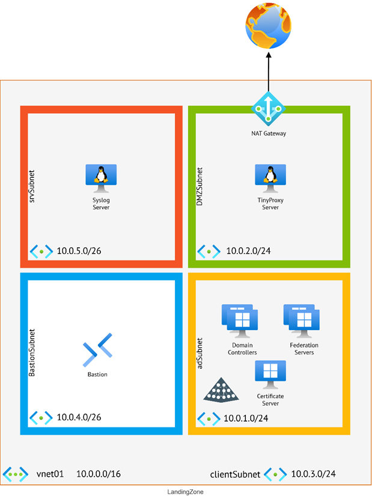

# Chapter 2: Setting up Microsoft Defender for Identity

This folder contains the necessary files to deploy the lab for the Microsoft Defender for Identity in Depth book.

## Table of Contents

- [Introduction](#introduction)
- [Prerequisites](#prerequisites)
- [Installation](#installation)
- [Usage](#usage)
- [Contributing](#contributing)
- [License](#license)

## Introduction

TBD

## Prerequisites

Before you can start deploying this lab, make sure you have the following prerequisites:

- Microsoft Defender for Identity subscription
- Access to an Azure Subscription

## Installation

To deploy this lab to Azure, click the button below:

1. Press the Deploy to Azure button and sign in to Azure with an account that has appropriate permissions to create new resources (e.g. Contributor role).
    
    [](https://portal.azure.com/#create/Microsoft.Template/uri/https%3A%2F%2Fraw.githubusercontent.com%2FPacktPublishing%2FMicrosoft-Defender-for-Identity-in-Depth%2Fmain%2FChapter02%2FLabDeployment%2Fmain.json)

2. Verify that the deployment was successful and that you can see all of the resources in your resource group.

## Usage

TBD

## Tests
To find your workspace name for MDI you need to go to the Defender portal, or the direct link: https://security.microsoft.com/settings/identities?tabid=about 

You can with the PowerShell cmdlet `Invoke-WebRequest` see if you have connectivity towards your MDI workspace. So, for the fictive company, Contoso Bank, the workspace name could be `contosobank`.

You can then test the connectivity with the following command:

```powershell
Invoke-WebRequest https://<your-workspace-name>sensorapi.atp.azure.com/tri/sensor/api/ping
```

For the Contoso Bank example, the command would be:

```powershell
Invoke-WebRequest https://contosobanksensorapi.atp.azure.com/tri/sensor/api/ping
```

Or using curl:

```bash
curl https://<your-workspace-name>sensorapi.atp.azure.com/tri/sensor/api/ping
```

For the Contoso Bank example, the command would be:

```bash
curl https://contosobanksensorapi.atp.azure.com/tri/sensor/api/ping
```

### MDI PowerShell Module
To install the MDI PowerShell module, you can use the following command:

```powershell
Install-Module -Name MicrosoftDefenderIdentity
```

*See [Chapter 3 – Leveraging MDI PowerShell for Automation and Management](../Chapter03/README.md) for manual installation of the module if you aren’t allowed to install this module on servers where the MDI sensor will be installed on.*

It’s highly recommended to get the current state of the environment with the cmdlet:

```powershell
New-MDIConfigurationReport [-Path] <String> [-Mode] <String> [-OpenHtmlReport]
```

- `Path` determines where reports will be saved
- `Mode` allows for selection between Domain or LocalMachine mode; the former sources settings from Group Policy objects while the latter from the local machine
- `OpenHtmlReport` triggers the HTML report to open once it's created

For example:
    
```powershell
New-MDIConfigurationReport -Path "C:\Reports" -Mode Domain -OpenHtmlReport
```

### Prerequisites for AD FS and AD CS

We will configure these servers later in the book but familiarize yourself with the different types of Defender tables in the Defender XDR portal. You will be running these KQL queries later to see if we are receiving any data.
The first query will see if we have any rows that include the word Adfs in the Protocol column from the table called `IdentityLogonEvents`.

```kql
IdentityLogonEvents | where Protocol contains 'Adfs'
```

Second query will see if we have any rows that equals (==) the word Adcs in the Protocol column from the table called `IdentityDirectoryEvents`.

```kql
IdentityDirectoryEvents | where Protocol == "Adcs"
```

### Lab Deployment





## MDI Sensor Installation
1. Extract the installation files from the .zip package with Expand-Archive cmdlet (adjust the different paths for your needs).

```powershell
$PathToInstallZipPackage = "C:\temp\Azure ATP Sensor Setup.zip"
$PathForDestinationFiles = "C:\install\MDI_sensor"
Expand-Archive -Path $PathToInstallPackage -DestinationPath $PathForDestinationFiles
```

2. Save the Access Key that we collected earlier in a variable, `$AccessKey`, and then run the installer with the arguments that you have decided on.

```powershell
$AccessKey = "<<Fill in the access key>>"
Set-Location $PathForDestinationFiles
.\"Azure ATP sensor Setup.exe" /quiet NetFrameworkCommandLineArguments="/q" AccessKey="$AccessKey"
```

Use below PowerShell script (or see file here - [Get-MDIInstallCode.ps1](./Get-MDIInstallCode.ps1)) to check for successful installation and output of the sensor version:

```powershell
$MDIInstallLog = Get-ChildItem -Path "$env:LocalAppData\Temp" -Filter "Azure Advanced Threat Protection Sensor_*_MsiPackage.log" -Recurse -ErrorAction SilentlyContinue | Sort-Object -Property LastWriteTime -Descending | Select-Object -First 1
if ($MDIInstallLog -eq $null) {
    Write-Host "MDI installation log file not found"
}
$MDIInstallCode = Get-Content -Path $MDIInstallLog.FullName | Select-String -Pattern "Installation completed successfully"
if ($MDIInstallCode -eq $null) {
    Write-Host "MDI installation code not found"
}
$MDIProductVersion = Get-Content -Path $MDIInstallLog.FullName | Select-String -Pattern "Product Version:"
if ($MDIProductVersion -match '\d+\.\d+\.\d+\.\d+') {
    $productVersion = $matches[0]
    Write-Host "Product version found."
} else {
    Write-Host "Product version not found."
}
Write-Host "MDI installation code: $MDIInstallCode"
Write-Host "MDI product version: $productVersion"
```

## Install TinyProxy
To install TinyProxy on an Ubuntu 22.04 minimal server installation, you will need to follow these steps:
1. Login or access your TinyProxy server.
2. Update your package list with the following command:

```bash
sudo apt update
```

3. Once the package list is updated, upgrade your system with:

```bash
sudo apt upgrade
```

4. This step is optional but recommended to ensure you have the latest versions of installed packages.
5. Install TinyProxy using the command:

```bash
sudo apt install tinyproxy
```

6. After installation, you'll need to configure TinyProxy. The configuration file is located at:

```bash
/etc/tinyproxy/tinyproxy.conf
```

7. You can edit this file with a text editor of your choice, for example, using nano:

```bash
sudo nano /etc/tinyproxy/tinyproxy.conf
```

8. In the configuration file, you can set various parameters such as the port TinyProxy listens on, which by default is port 8888. You can change this if necessary. More about the configuration file under the section Configuring TinyProxy.
9. Set up Allow/Deny rules in the configuration file to control which clients can access your proxy server.
10. Once you have configured TinyProxy to your liking, save the changes (`CTRL + O`) and exit the text editor (`CTRL + X`) .
11.	Restart TinyProxy to apply the changes with the command:

```bash
sudo systemctl restart tinyproxy
```

12.	You can also enable TinyProxy to start on boot with:

```bash
sudo systemctl enable tinyproxy
```

## Configuring TinyProxy
Open the file `/etc/tinyproxy/tinyproxy.conf` with a text editor of your choice, for example, using `nano`:

```bash
sudo nano /etc/tinyproxy/tinyproxy.conf
```

Now you can start forming the configuration file for your needs. See the following example configuration [TinyProxy Configuration](./tinyproxy.conf).

## DSA Configuration
### Group Managed Service Account (gMSA)

To create a gMSA, you need to have the Active Directory PowerShell module installed. You can install it with the following command:

```powershell
Install-WindowsFeature RSAT-AD-PowerShell
```

After the module is installed, we need to create Key Distribution Services (KDS) Root Key. This is done by following these steps:

1.	Connect to one of your domain controllers in a secure way (we need to think of our tiering).
2.	Start Windows PowerShell from the start menu.
3.	Type the following command and see if you get any output:

```powershell
Get-KdsRootKey
```

4.	If the KDS root key does not exist, keep following the guide and commands.
5.	In the same Windows PowerShell window, now type the following command which will create a new KDS root key on the domain controller running the command, the KDS service can use the root key directly, but other domain controllers need to wait for the Active Directory replication:

```powershell
Add-KdsRootKey -EffectiveImmediately
```

Now that we have verified and, for some of you, created the KDS root key it’s time to create our gMSA account.

1. Connect to one of your domain controllers in a secure way (we need to think of our tiering).
2. Start Windows PowerShell from the start menu.
3. Create new variables with the name of the gMSA account, name of the sensor group that will contain all the computer accounts where we had installed the MDI sensor on, and then a list of all computer accounts (change accordingly):

```powershell
$gMSA_Name = 'MDIGMSA'
$gMSA_HostsGroupName = 'MDIGroup'
$gMSA_HostNames = 'DC1', 'DC2', 'ADCS1', 'EntraConnect', 'ADFS1'
```

4. Now create the sensor group and add the computer accounts to the group:

```powershell
$gMSA_HostsGroup = New-ADGroup -Name $gMSA_HostsGroupName -GroupScope DomainLocal -PassThru
$gMSA_HostNames | ForEach-Object { Get-ADComputer -Identity $_ } | ForEach-Object { Add-ADGroupMember -Identity $gMSA_HostsGroupName -Members $_ }
```

5. Type the following command to create the gMSA account and add the sensor group so the computer accounts can retrieve the gMSA password: 

```powershell
New-ADServiceAccount -Name $gMSA_Name -DNSHostName $gMSA_Name.$env:USERDNSDOMAIN -Description "Microsoft Defender for Identity gMSA account" -KerberosEncryptionType AES256 -PrincipalsAllowedToRetrieveManagedPassword $gMSA_HostsGroup
```

Using AES256 with gMSA accounts is important for securing Active Directory environments. It provides stronger encryption, making it much harder for attackers to crack Kerberos tickets compared to older methods like RC4 or DES, which have known vulnerabilities. By setting the KerberosEncryptionType to AES256, you ensure that your gMSA uses a higher standard of encryption, aligning with best practices and offering better protection against potential identity-based attacks.

6. To verify that the gMSA is created, run the following command:

```powershell
Get-ADServiceAccount -Name $gMSA_Name
```

7. Verify that the domain controller can retrieve the password for the gMSA, the output we strive for is the value of `True`:

```powershell
Test-ADServiceAccount
```

8. If you haven’t already, we need to activate the Recycle Bin feature in Active Directory and we can do that with the following command:

```powershell
Enable-ADOptionalFeature -Identity 'Recycle Bin Feature' -Scope ForestOrConfigurationSet -Target (Get-ADDomain).DNSRoot -Confirm:$false
```

9. The gMSA account need the read permissions, so first we will capture the distinguished name of the deleted objects container, we will then take ownership of that container before we finally grant the identity the permissions of List Contents and Read Property 

```powershell
$distinguishedName = ([adsi]'').distinguishedName.Value
$deletedObjectsDN = 'CN=Deleted Objects,{0}' -f $distinguishedName
$params = @("$deletedObjectsDN", '/takeOwnership')
C:\Windows\System32\dsacls.exe $params
$params = @("$deletedObjectsDN", '/G', ('{0}\{1}:LCRP' -f ([adsi]'').name.Value, $Identity))
C:\Windows\System32\dsacls.exe $params
```


## Contributing

Contributions are welcome! If you have any improvements or bug fixes, feel free to submit a pull request.

## License

This project is licensed under the [MIT License](LICENSE).
