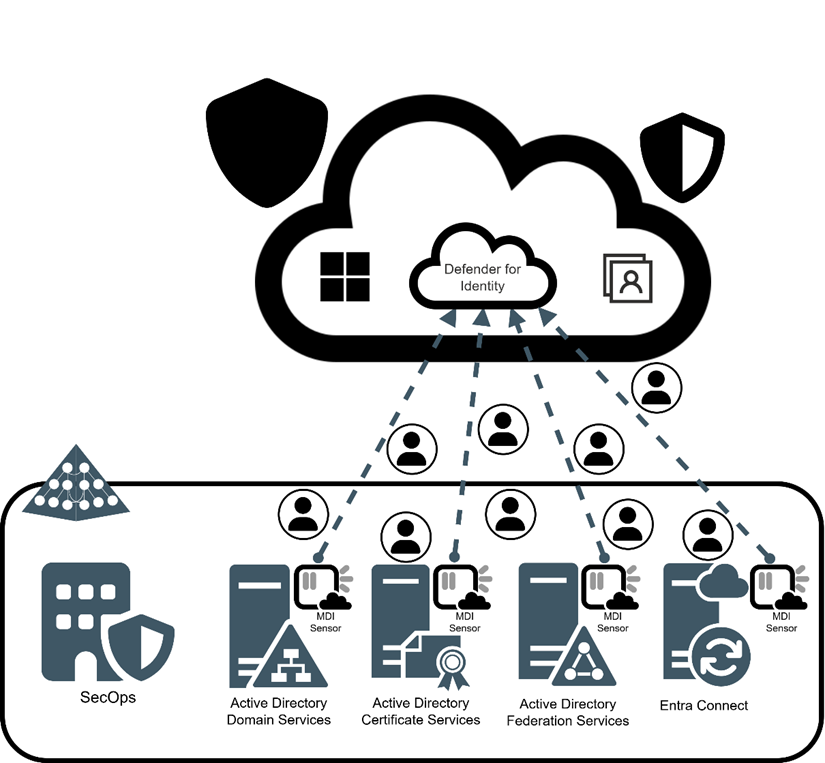

# Microsoft Defender for Identity in Depth

<a href="https://www.packtpub.com/en-us/product/microsoft-defender-for-identity-in-depth-9781835884492"></a>
This is the code repository for [Microsoft Defender for Identity in Depth](https://www.packtpub.com/en-us/product/microsoft-defender-for-identity-in-depth-9781835884492), published by Packt.

An exhaustive guide to ITDR, breach prevention, and cyberattack response.

## What is this book about?
Learn all about Microsoft Defender for Identity in depth and master the art of securing digital identities against emerging threats with hands-on guidance to elevate your cybersecurity skills to new heights.

This book covers the following exciting features:
* Ensure a secure and efficient MDI setup for peak defense capabilities
* Unlock automation with PowerShell scripting magic
* Seamlessly blend MDI with AD CS, AD FS, and Entra Connect
* Expand MDI’s reach and impact through APIs
* Pioneer advanced threat hunting with KQL expertise in Defender XDR
* Craft expert, strategic responses to security alerts
* Optimize action accounts for maximum agility
* Establish a robust and rigid ITDR framework

If you feel this book is for you, get your [copy](https://www.amazon.com/Microsoft-Defender-Identity-Depth-cyberattack/dp/B0DK1HW2KX/) today!

## Table of Contents
- [Introductions and Navigations](#introductions-and-navigations)
- [Software and Hardware List](#software-and-hardware-list)

## Introductions and Navigations
MDI is designed to protect on-premises Active Directory (AD) identities, our core foundation of the organization and its primary feature is to monitor user activities, network traffic, Windows events, and entity behaviors continuously. It uses advanced algorithms and machine learning to detect unusual activities, such as lateral movement, privilege escalation, and reconnaissance attacks, which could indicate potential security breaches.



### Code examples
All of the code is organized into folders. For example, Chapter02.

The code will look like the following:

#### KQL

```kql
IdentityLogonEvents 
| where Protocol contains 'Adfs'
```

#### Bicep

```bicep
resource storageAccount 'Microsoft.Storage/storageAccounts@2021-04-01' = {
    name: 'mystorageaccount'
    location: resourceGroup().location
    sku: {
        name: 'Standard_LRS'
    }
    kind: 'StorageV2'
    properties: {
        accessTier: 'Hot'
    }
}
```

#### PowerShell

```powershell
# Example PowerShell script to retrieve MDI alerts

# Connect to Microsoft Defender for Identity
$tenantId = "your-tenant-id"
$clientId = "your-client-id"
$clientSecret = "your-client-secret"
$resource = "https://api.atp.azure.com"

$body = @{
    grant_type    = "client_credentials"
    client_id     = $clientId
    client_secret = $clientSecret
    resource      = $resource
}

$response = Invoke-RestMethod -Method Post -Uri "https://login.microsoftonline.com/$tenantId/oauth2/token" -ContentType "application/x-www-form-urlencoded" -Body $body
$token = $response.access_token

# Retrieve alerts
$headers = @{
    Authorization = "Bearer $token"
}

$alerts = Invoke-RestMethod -Method Get -Uri "https://api.atp.azure.com/v1.0/alerts" -Headers $headers
$alerts.value | ForEach-Object {
    Write-Output "Alert ID: $_.id"
    Write-Output "Title: $_.title"
    Write-Output "Severity: $_.severity"
    Write-Output "Status: $_.status"
    Write-Output "-----------------------------------"
}
```

### Chapters

In this GitHub repository, you will find the scripts, KQL queries, lab files, and configuration files used in the book. The book is divided into the following chapters:
- Chapter 1: Introduction to Microsoft Defender for Identity
- [Chapter 2: Setting up Microsoft Defender for Identity](./Chapter02/README.md)
- [Chapter 3: Leveraging MDI PowerShell for Automation and Management](./Chapter03/README.md)
- [Chapter 4: Integrating MDI with AD FS, AD CS, and Entra Connect](./Chapter04/README.md)
- [Chapter 5: Extending MDI capabilities through APIs](./Chapter05/README.md)
- [Chapter 6: Mastering KQL for Advanced Threat Detection in MDI](./Chapter06/README.md)
- [Chapter 7: Investigating and Responding to Security Alerts](./Chapter07/README.md)
- [Chapter 8: Utilizing MDI Action Accounts Effectively](./Chapter08/README.md)
- [Chapter 9: Building a Resilient Identity Threat Detection and Response Framework](./Chapter09/README.md)
- [Chapter 10: Navigating Challenges: MDI Troubleshooting and Optimization](./Chapter10/README.md)

**Following is what you need for this book:**
If you’re an IT or security professional looking to enhance your cybersecurity skills, especially in identity protection and threat management with Microsoft Defender for Identity (MDI), then this book is for you. It's perfect for system administrators, cybersecurity analysts, and cloud engineers who want to strengthen their expertise in MDI. A basic understanding of cybersecurity principles, as well as familiarity with Microsoft environments and Active Directory are recommended prerequisites for maximizing your learning experience.

With the following software and hardware list you can run all code files present in the book.

## Software and Hardware List
Given the expansive nature of Microsoft 365 and its associated ecosystem, setting up and optimizing MDI demands specific prerequisites. These requirements are essential for ensuring seamless integration and functionality within the Microsoft 365 framework, catering to both security needs and operational efficiency.

| Software / Hardware required | OS required / Other requirements |
| ------------------------------------ | ----------------------------------- |
| Microsoft tenant | Windows, Linux, MacOS |
| Azure subscription | Azure |
| Active Directory, AD CS, AD FS, Entra Connect | Windows Server |
| TinyProxy | Ubuntu |

You will require the following:
- Microsoft tenant
- Microsoft subscription that includes Microsoft Defender for Identity, such as:
    - Microsoft 365 E5
    - Microsoft 365 E5 Security
    - Microsoft 365 E5/A5/G5
    - Enterprise Mobility + Security E5
    - A standalone Defender for Identity license
- Basic Microsoft 365 knowledge
- Active Directory knowledge
- A virtual or physical server environment with Active Directory installed and configured
    - Optional: Active Directory Federation Services and Active Directory Certificate Services installed and configured 
- Basic PowerShell knowledge
- Basic networking knowledge
- Optional: If you want to follow along with proxy setup and configuration you need 1-2 virtual machines with Ubuntu 22.04 or later installed
    - Make the installation of Ubuntu a minimal server installation

### Related products
* Microsoft Intune Cookbook [[Packt]](https://www.packtpub.com/en-us/product/microsoft-intune-cookbook-9781805126546) [[Amazon]](https://www.amazon.com/dp/1805126547)

* Mastering Microsoft 365 Defender [[Packt]](https://www.packtpub.com/en-us/product/mastering-microsoft-365-defender-9781803241708) [[Amazon]](https://www.amazon.com/dp/1803241705)

## Get to Know the Author
**Pierre Thoor**
 is a Microsoft MVP in security and a dedicated cybersecurity expert with a focus on identity protection and threat detection. As a first-time author, he shares his extensive knowledge in this book. Pierre hosts the Security Dojo Podcast and blogs at thoor.tech, where he explores Microsoft security topics. As an international speaker, he makes complex security subjects accessible to audiences worldwide.
At Onevinn, Pierre delivers advanced security solutions that strengthen organizations’ defenses against cyber threats. He specializes in Microsoft Sentinel and Microsoft Defender XDR. Pierre is also an expert in Azure Governance, including the Cloud Adoption Framework and enterprise-scale landing zones, ensuring that security is integrated into every aspect of cloud adoption. With skills in DevOps practices, Kusto Query Language (KQL), and developing solutions with Bicep and PowerShell, he implements automation and infrastructure as code to enhance security operations.
Pierre assists organizations in navigating the complexities of modern cybersecurity challenges.
